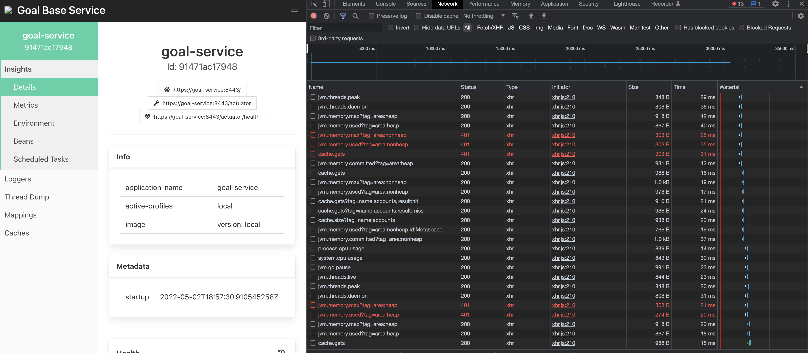

# Spring Boot Admin 302/403 Issue

Should be able to spin up the instance by running ./runDev.sh bash script. 
  - if you run into issues proxy config might not be set right for open network.
  
Will need to self serve any spring service to register to the admin instance. 

#Isssue Explanation:
* Login to SBA http://localhost:8080 ( user:admin , password:admin )
* Navigate to insight -> Details page
* Open browser dev tools and notice random 401's 

